# EVM Nestable Demo

### A contextualized user journey to explore and understand the Nestable NFT features

Nestable is a Solidity smart contract implementation by [RMRK Team](https://github.com/rmrk-team) that allows an NFT to own another NFT.
In this journey we will explore the main features of the [Nestable RMRK](https://github.com/rmrk-team/evm/blob/master/contracts/implementations/RMRKNestableImpl.sol).

##### The use cases that will be explored are:

- **Creation** of a multi-level NFTs hierarchy;
- **Transfer** of NFTs between hierarchy owners and/or hierarchy levels;
- **Burn** NFTs at different hierarchy levels.

## User journey context

To better understand the different use cases of this standard we will transform them in situation where the dynamics are clear because we are already familiar with them, but every action will be performed with smart contract functions with the help of some _Typescript_ code. :muscle:

_We are in the Medieval epoch and in the universe there is a Wizard who can do whatever he wants._
_During a special day the wizard decided to give life to 2 kings, each one with his own Kingdom and then he allowed the kings to model their kingdoms._
_What happened after is discoverable following the user journey, so have fun and happy learning!_

### The Kingdoms genesis - Multi-level hierarchy creation

The day 0 the Wizard decided that the universe will be structured in this way:

- 2 Kingdom, each one with 1 king
- 5 Armies: 3 for the first kingdom and 2 for the other one
- 90 Soldiers: distributed between the 5 armies, but not in equal parts.

The first move was so to create the 2 kingdoms and give them to their owners, the Kingdom 1 to the **King One** (very original name :satisfied:) and the Kingdom 2 to the **King Two**.

```typescript
const FIRST_KINGDOM_ID = 1
const SECOND_KINGDOM_ID = 2

let firstKingdomCreationTx = await kingdomSCInstance.mint(KING_ONE.address, 1, {
  value: pricePerKingdom,
})
await firstKingdomCreationTx.wait()
let secondtKingdomCreationTx = await kingdomSCInstance.mint(
  KING_TWO.address, // receiver address
  1, // tokens to mint
  { value: pricePerKingdom } // total minting price
)
await secondtKingdomCreationTx.wait()
```

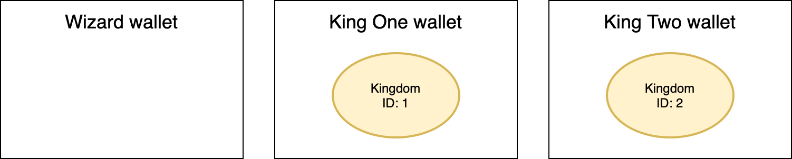

After that the Wizard decided to create the armies and did it by making them appear **directly** in the respectively kingdoms.

```typescript
const FIRST_KINGDOM_ARMIES = 3
const SECOND_KINGDOM_ARMIES = 2

let firstArmyTx = await armySCInstance.nestMint(    // mint directly into parent NFT
  kingdomSCInstance.address,    // destination NFT contract address
  FIRST_KINGDOM_ARMIES,         // tokens to mint
  FIRST_KINGDOM_ID,             // parent token ID
  { value: pricePerArmy.mul(FIRST_KINGDOM_ARMIES) } // total minting price
)
await firstArmyTx.wait()
let secondArmyTx = await armySCInstance.nestMint(   // mint directly into parent NFT
  kingdomSCInstance.address,    // destination NFT contract address
  SECOND_KINGDOM_ARMIES,        // tokens to mint
  SECOND_KINGDOM_ID,            // parent token ID
  { value: pricePerArmy.mul(SECOND_KINGDOM_ARMIES) }    // total minting price
)
await secondArmyTx.wait()
```
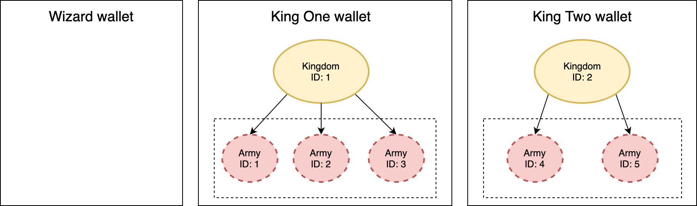

But the a gift can't be **accepted** without the permission of the receiver so after that the armies were distributed the kings controlled them and accepted to guide the armies with honor and respect.

```typescript
for (let i = FIRST_KINGDOM_ARMIES - 1; i >= 0; i--) {
  let tx = await kingdomSCInstance
    .connect(KING_ONE)          // Assure that King One is the transaction signer
    .acceptChild(               // Move child from pending array to active array
      FIRST_KINGDOM_ID,         // ID of the parent token that will receive the child
      i,                        // index of the child ing the pending children array
      armySCInstance.address,   // parent token smart contract address
      firstPendingArmies[i][0]  // child token ID
    )
  tx.wait()
}

for (let i = SECOND_KINGDOM_ARMIES - 1; i >= 0; i--) {
  let tx = await kingdomSCInstance
    .connect(KING_TWO)          // Assure that King Two is the transaction signer
    .acceptChild(               // Move child from pending array to active array
      SECOND_KINGDOM_ID,        // ID of the parent token that will receive the child
      i,                        // index of the child ing the pending children array
      armySCInstance.address,   // parent token smart contract address
      secondPendingArmies[i][0] // child token ID
    )
  tx.wait()
}
```


Wait a moment... these armies are **empty**! The Wizard created them but he forgot to add the soldiers... :sweat_smile:
It is better to repair to this problem a soon as possible and then **fill** the armies!

```typescript
// Mint soldiers
await soldierSCInstance
  .connect(WIZARD)
  .mint(WIZARD.address,     // minter address
    MAX_SOLDIER_TOKENS,     // number of tokens to mint    
    { value: pricePerSoldier.mul(MAX_SOLDIER_TOKENS) }) // total minting price

const soldiersDistribution = [10, 20, 30, 14, 16]
var soldierIdToMint = 1
```
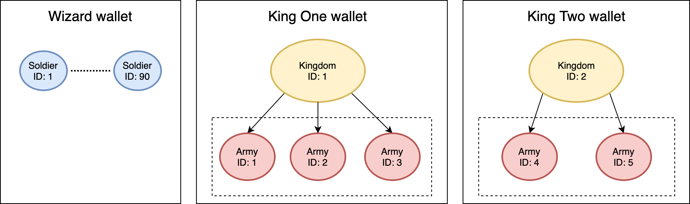

```typescript
// Assign each soldier to his army
for (let i = 0; i < soldiersDistribution.length; i++) {
  const toMint = soldiersDistribution[i]
  const armyId = i + 1
  for (let j = 0; j < toMint; j++) {
    await soldierSCInstance
      .connect(WIZARD)
      .nestTransferFrom(        // transfer token (child) directly into a new parent
        WIZARD.address,         // child owner from which transfer the token
        armySCInstance.address, // parent smart contract address
        soldierIdToAdd,         // child token ID
        armyId,                 // parent token ID
        []                      // additional data for the transaction
      )
    soldierIdToAdd++
  }
}

// Accept the soldiers in the armies
for (let j = 0; j < armiesComposition.length; j++) {
  for (let i = soldiersDistribution[j] - 1; i >= 0; i--) {
    if (j < 3) {
      await armySCInstance
        .connect(KING_ONE)              // make King One the transaction signer 
        .acceptChild(                   // Move child from pending array to active array
          j + 1,                        // ID of the parent token that will receive the child
          i,                            // index of the child ing the pending children array
          soldierSCInstance.address,    // parent token smart contract address
          armiesComposition[j][i][0]    // child token ID
        )
    } else {
      await armySCInstance
        .connect(KING_TWO)              // make King Two the transaction signer 
        .acceptChild(                   // Move child from pending array to active array
          j + 1,                        // ID of the parent token that will receive the child
          i,                            // index of the child ing the pending children array
          soldierSCInstance.address,    // parent token smart contract address
          armiesComposition[j][i][0]    // child token ID
        )
    }
  }
}
```

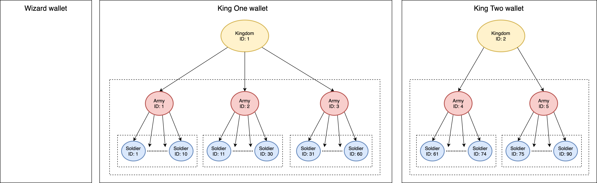

Finally each Kingdom is complete!
The Wizard can now relax and retire in some quiet place to think about the next game. :sunglasses:

## Armies balancing - Transfer NFTs inside and outside the hierarchy

The 2 Kingdoms have been created and set up, but the King One isn't happy. He noticed that he has 3 armies, but very _unbalanced_.
In particular he noticed that there is a big difference between the first and the third army (with respectively 30 and 10 soldiers each).

```typescript
const biggerArmyId = 3
const smallerArmyId = 1
const bigArmy = await armySCInstance.childrenOf(biggerArmyId)
console.log("Bigger army soldiers amount now: %d", bigArmy.length)
const smallerArmy = await armySCInstance.childrenOf(smallerArmyId)
console.log("Smaller army soldiers amount now: %d", smallerArmy.length)
```
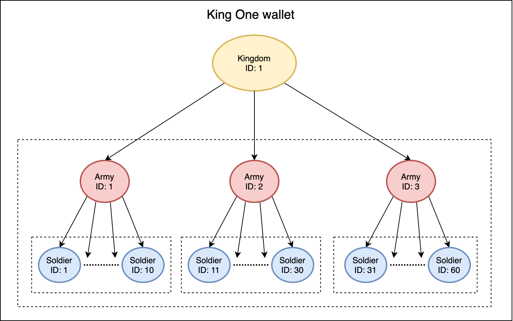

So he decided to re-balance a little the 2 armies by removing 5 soldiers from the first one and assigning these soldiers to the third.

```typescript
for (let i = 0; i < 5; i++) {
  let soldierToRemoveIndex = bigArmy.length - 1 - i // we procede from last one back to the first one
  let soldierToRemoveId = bigArmy[soldierToRemoveIndex][0]
  console.log(
    "Removing from %d army the soldier with ID %s...",
    biggerArmyId,       // ID of the parent token from which remove the child
    soldierToRemoveId   // Child token ID to remove
  )

  await armySCInstance
    .connect(KING_ONE)          // make King One the transaction signer 
    .transferChild(             // transfer child token away from its parent
      biggerArmyId,             // ID of the parent token that actually owns the child
      armySCInstance.address,   // parent token smart contract address
      smallerArmyId,            // parent token ID
      soldierToRemoveIndex,     // position of the child token in active children array
      soldierSCInstance.address,    // child token smart contract address
      soldierToRemoveId,        // ID of the child token to transfer
      false,                    // is child token in the pending children array
      []                        // additional transaction data
    )
}
```
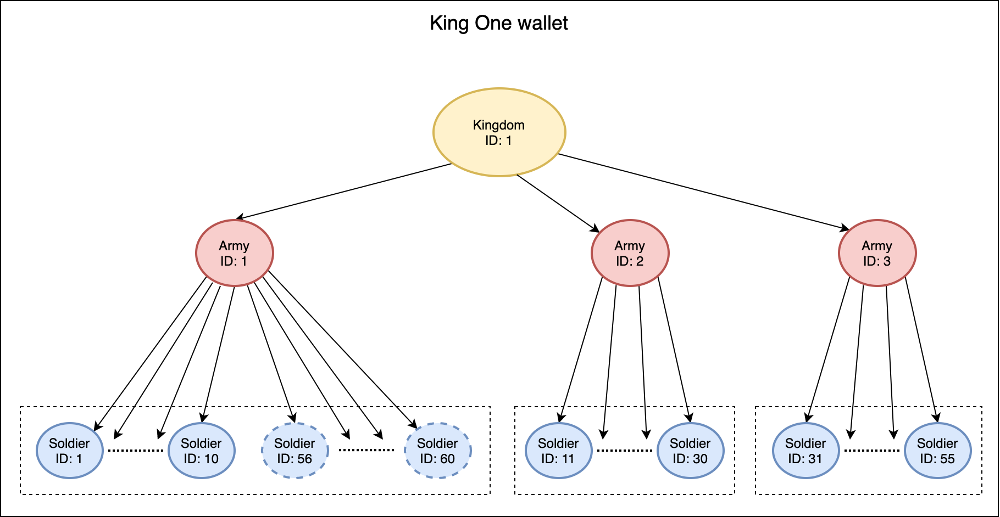

Integrate in a new team has always some difficulty, but after proving their value the new soldiers have been accepted and they became part of the group, the third army.

```typescript
for (let i = 0; i < 5; i++) {
  let soldierToAddIndex = pendingSoldiers.length - 1 - i // we procede from last one back to the first one
  let soldierToAddId = pendingSoldiers[soldierToAddIndex][0]
  await armySCInstance
    .connect(KING_ONE)              // make King One the transaction signer 
    .acceptChild(                   // Move child from pending array to active array
      smallerArmyId,                // ID of the parent token that will receive the child
      soldierToAddIndex,            // index of the child ing the pending children array
      soldierSCInstance.address,    // parent token smart contract address
      soldierToAddId                // child token ID
    )
}
```

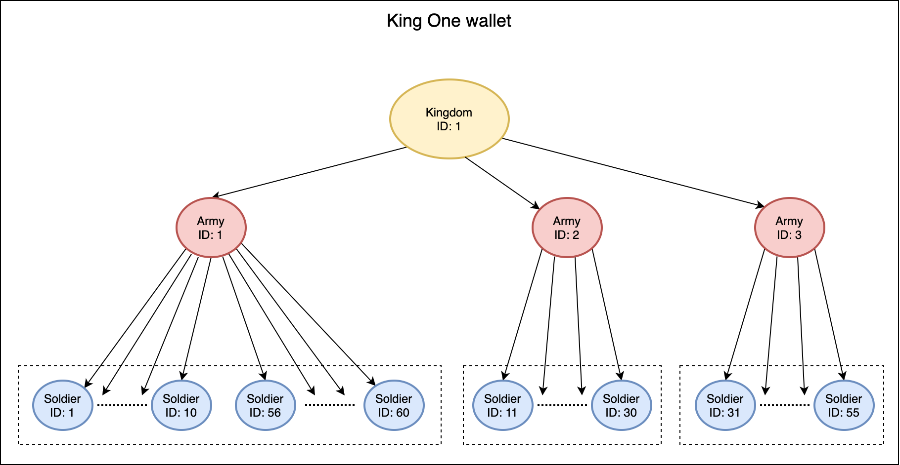

Good job, now the armies look more balanced! :blush:

## The Black Death - Burn NFTs at different hierarchy levels

It has been a florid period since the 2 kings have put to govern their kingdoms, but as we already know nothing goes right forever.
It was the year 1346 when a soldier, just came back from an exploration mission, died because of the bubonic plague. :skull:
After seeing the body of the unlucky man (still alive) the King One decided to **move it away** from the second army and take him to the palace in order to observe the problem closer and try to find a solution.

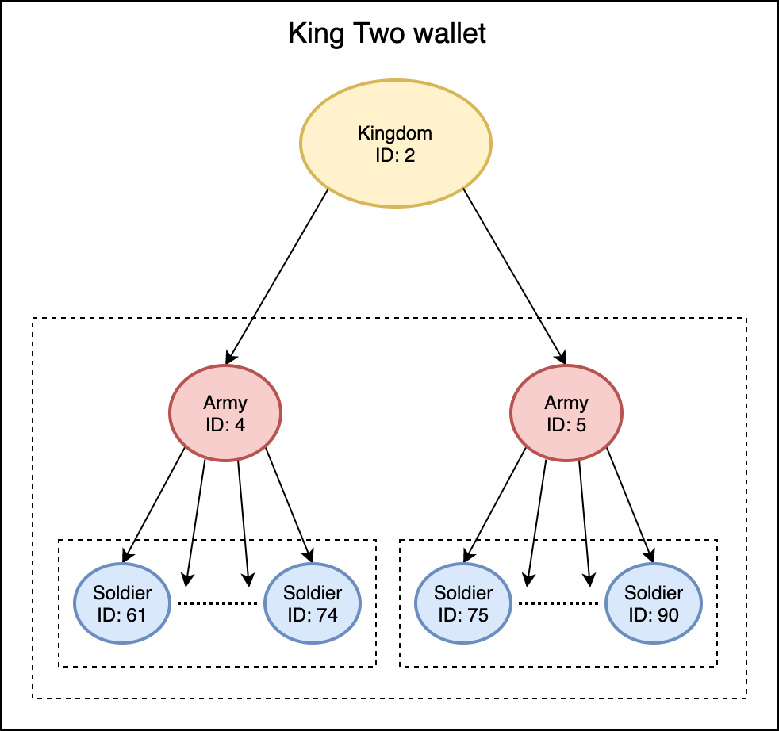

```typescript
const secondArmyId = 2
let secondArmySoldiers = await armySCInstance.childrenOf(secondArmyId)
const secondArmyLastSoldierIndex = secondArmySoldiers.length - 1
let secondArmyLastSoldierId =
  secondArmySoldiers[secondArmySoldiers.length - 1][0]

await armySCInstance
  .connect(KING_ONE)                // make King One the transaction signer 
  .transferChild(                   // transfer child token away from its parent
    secondArmyId,                   // ID of the parent token that actually owns the child 
    KING_ONE.address,               // address of the future token (child) owner
    0,                              // 0 because the future owner will not be another NFT
    secondArmyLastSoldierIndex,     // index of the child token in the active children array
    soldierSCInstance.address,      // child token smart contract address
    secondArmyLastSoldierId,        // ID of the child token to transfer
    false,                          // is child token in the pending children array
    []                              // additional transaction data
  )
```
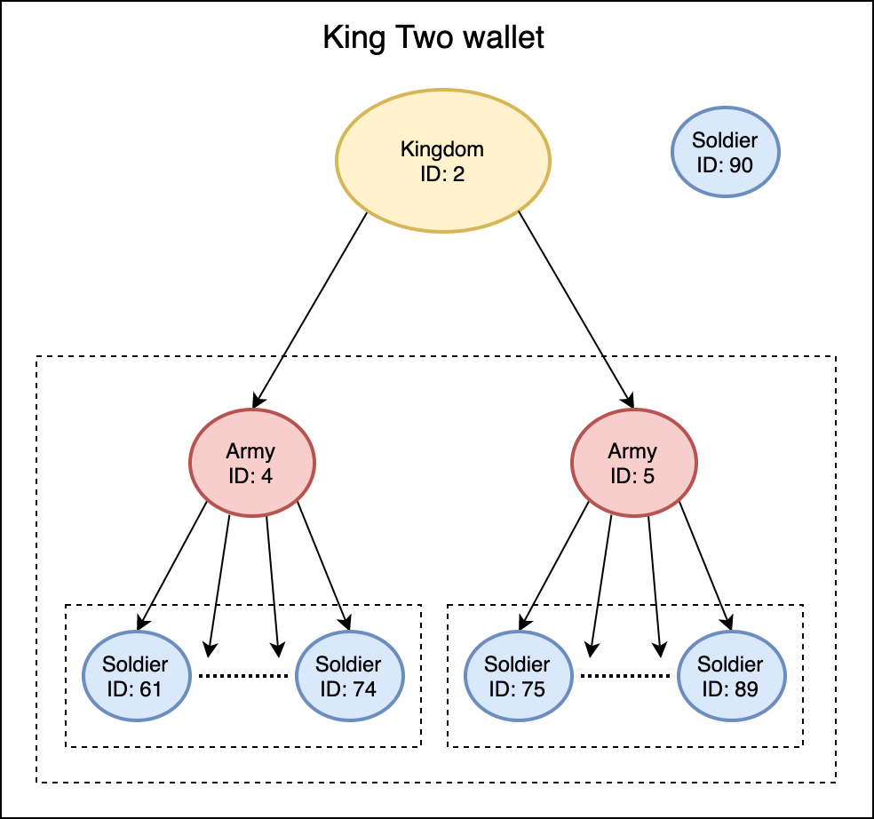

Several days passed and the situation didn't get better and finally, after 2 weeks of pain, the soldier died.
The King One immediately decided to burn the body to limit the infection...

```typescript
await soldierSCInstance
  .connect(KING_ONE)                            // make King One the transaction signer 
  ["burn(uint256)"](secondArmyLastSoldierId)    // ID of the token to burn 
```
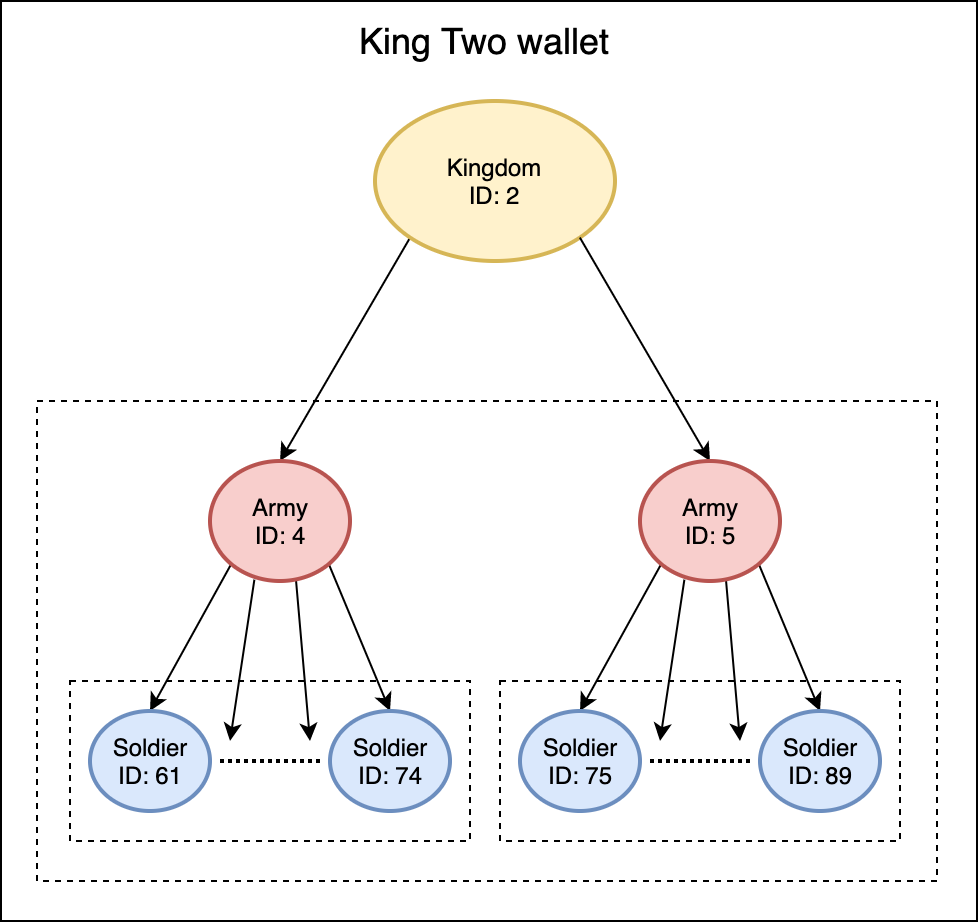

But this wasn't enough. The infection has already spread inside the second army involving.
A decision needs to be taken.
The sad king decided to push the entire army away in an isolated place inside the kingdom, with every object and thing related to it, and this was a wise choice.

```typescript
const secondArmyIndex = 1 // index of the second army in the children list of the first kingdom
await kingdomSCInstance
  .connect(KING_ONE)            // make King One the transaction signer 
  .transferChild(               // transfer child token away from its parent
    FIRST_KINGDOM_ID,           // ID of the parent token that actually owns the child 
    KING_ONE.address,           // address of the future token (child) owner
    0,                          // 0 because the future owner will not be another NFT
    secondArmyIndex,            // index of the child token in the active children array
    armySCInstance.address,     // child token smart contract address
    secondArmyId,               // ID of the child token to transfer
    false,                      // is child token in the pending children array
    []                          // additional transaction data
  )
```
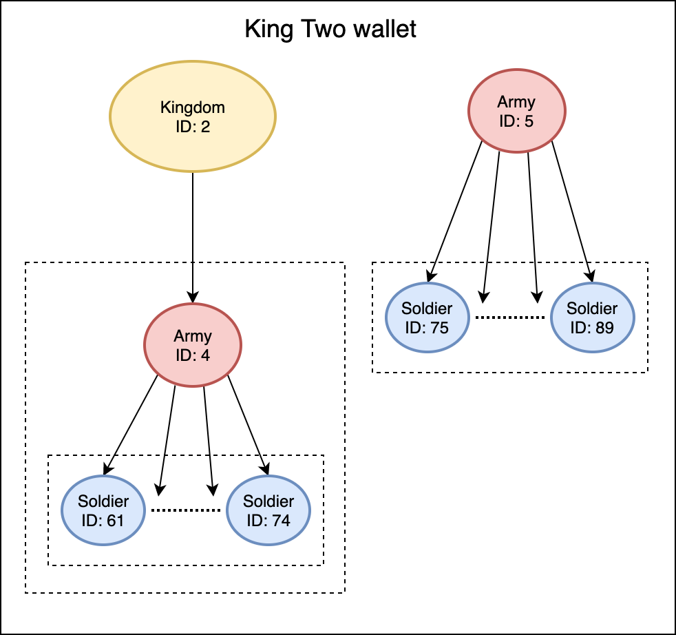

The entire army died after a month and the King burned every man and object to prevent the plague to come back again and do other damages to the kingdom.

```typescript
secondArmySoldiers = await armySCInstance.childrenOf(secondArmyId)
// Burn recursively the army and its the children
await armySCInstance
  .connect(KING_ONE)                        // make King One the transaction signer 
  ["burn(uint256,uint256)"](secondArmyId,   // ID of the token to burn
   secondArmySoldiers.length)               // number of children to burn
```
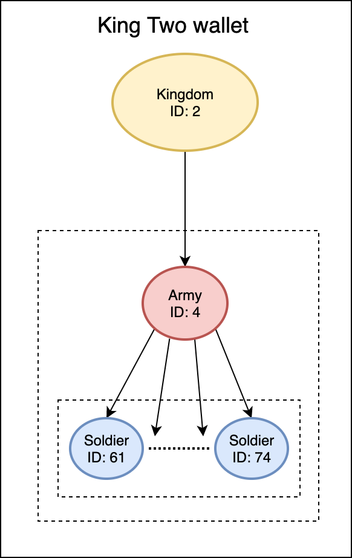

Sometimes do the right this is not easy, but the King One was wise and he contained the infection saving the rest of its kingdom.

## User journey summary

In this tutorial we have seen how to interact with the Nestable implementation in order to:

1. :point_right: **Create** multi-level hierarchies with the kingdoms and their composition;
2. :point_right: **Transfer** NFTs between different parts of the hierarchy and also how to remove them (soldiers movements between the first and the third army);
3. :point_right: **Burn** NFTs at the lowest level of a hierarchy (the first soldier affected by the Black Death) and entire sub-hierarchies (like the second army after the infection).

## Bugs, doubts and help :pray:

For clarifications, bug reporting or help needed please open a Github issue or write a message in the telegram:

- **Telegram**: https://t.me/rmrkimpl